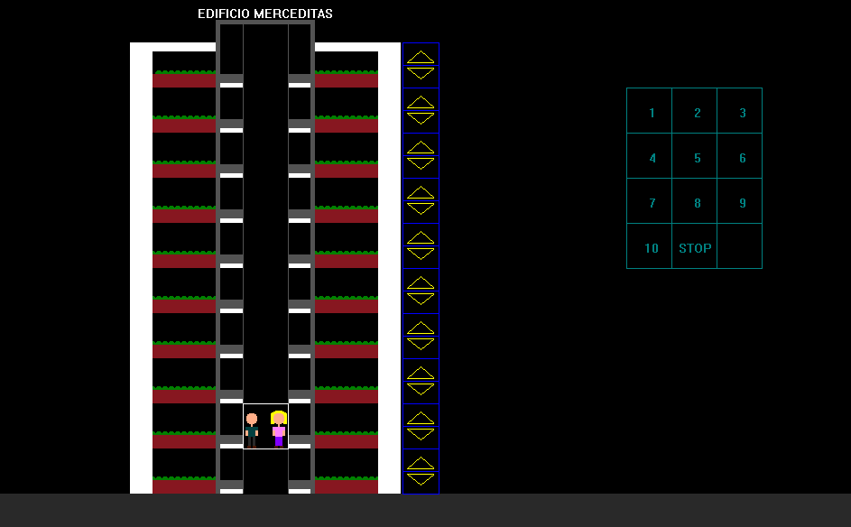
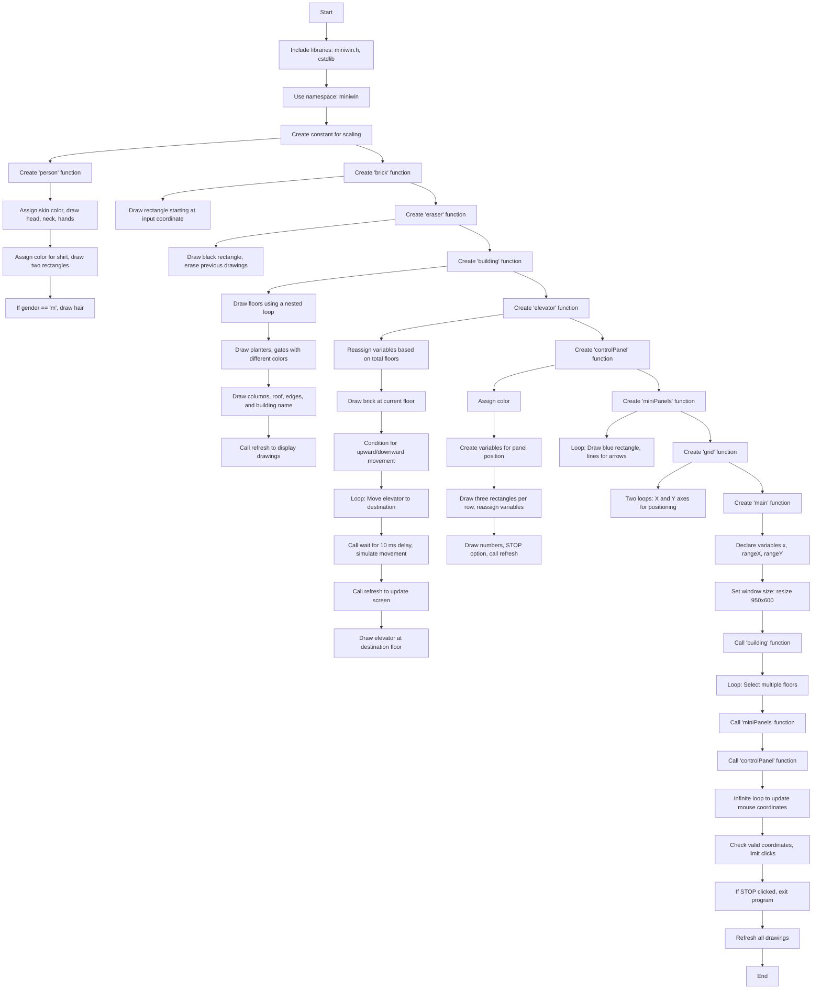

<!-- omit in toc -->
# :elevator:Elevator Simulator

**Professor:**  
Manuel Leonardo Mosquera Palomino

**National University of Colombia**  
**Faculty of Engineering**  
**Department of Systems and Industrial Engineering**  
**Bogotá D.C., 2016**

<!-- TABLE OF CONTENTS -->
<!-- omit in toc -->
## Table of contents
- [Introduction](#introduction)
- [Motivation](#motivation)
- [Functionality](#functionality)
- [Pseudocode](#pseudocode)
  - [Flowchart](#flowchart)
- [Conclusions](#conclusions)
- [Authors](#authors)
- [Bibliography](#bibliography)

## Introduction

This document presents a program that uses various concepts learned during the Computer Programming course. The program simulates an elevator and was created using the C++ language with the Dev C++ program. This program includes the **miniwin.h** library, which was developed to print figures in the console and interact with them minimally.

## Motivation

The reason we chose to work on this project is that it represents a significant challenge that tests our ability to apply programming skills to real-world problems. In this case, we chose an elevator, which required us to design the logical structure for its operation, as well as the graphical part that represents the elevator's physical structure.

## Functionality

The program simulates the movement of an elevator. Two sets of control panels are used to guide its movement: one is located next to the building, where users can call the elevator, and another shows the floor numbers. First, a button is pressed to request the elevator, causing it to move to the requested floor. Then, from the second panel, the desired destination floor is selected, and the elevator moves accordingly.

## Pseudocode

1. **Include libraries**:

    - Include `miniwin.h` and `cstdlib`.

2. **Use namespace**:

    - Use the `miniwin` namespace.

3. **Create constant for scaling**.

4. **Create `person` function** (parameters: position, gender):

    1. Assign skin color and draw head, neck, and hands.
    2. Assign any color and draw two rectangles for the shirt (one for the sleeves, the other for the rest).
    3. If `gender == 'm'`, draw small circles for hair.

5. **Create `brick` function** (input: coordinate):

    1. Draw a rectangle starting at the given coordinate.
    2. The endpoint is the starting coordinate plus the scale.

6. **Create `eraser` function** (no parameters):

    1. Draw a black rectangle the size of the elevator.
    2. Draw a smaller filled rectangle to erase what is passed without causing errors.

7. **Create `building` function** (parameters: location, number of floors):

    1. Inside a `while` loop nested in a `for` loop, draw the floors at each level.
    2. In the `for` loop:
        - Draw planters, floors, and gates for each floor with different colors.
    3. Draw columns, the roof, and the building's edges with different colors using `color_rgb`.
    4. Use the `text` function to print the building's name.
    5. Call `refresh` to display the drawings.

8. **Create `elevator` function** (parameters: current floor, destination floor, total floors):

    1. Reassign variables based on the total floors to prevent the elevator from moving in the wrong direction.
    2. Draw a brick at the position of the current floor.
    3. Add a condition to restrict upward or downward movement.
    4. Create a loop:
        - Initialize a counter at the current floor.
        - Move by `+0.001` or `-0.001` until reaching the destination.
    5. Constantly draw and erase the elevator to simulate movement, calling `wait` with a 10 ms delay.
    6. Call `refresh` to update the screen.
    7. Draw the elevator at the destination floor.

9. **Create `controlPanel` function**:

    1. Assign color `0128128`.
    2. Create variables for the control panel's initial position.
    3. Use a `for` loop to draw three rectangles per row.
    4. Reassign positioning variables.
    5. Draw numbers and the STOP option according to the grid.
    6. Call `refresh` to update the drawings.

10. **Create `miniPanels` function**:

    1. Use a `for` loop with a counter up to the total number of floors.
    2. Draw a blue rectangle and lines to simulate an arrow.

11. **Create `grid` function**:

    - Use two loops: one for the X-axis, another for the Y-axis.

12. **Create `main` function**:

    1. Declare variables `x`, `rangeX`, and `rangeY`.
    2. Set the window size using `resize(950, 600)`.
    3. Call the `building` function.
    4. Create a loop for selecting multiple floors.
    5. Call the `miniPanels` function.
    6. Call the `controlPanel` function.
    7. Create an infinite loop to update the mouse's coordinates:
        - If the coordinates are valid:
            1. Call `mouse_left_button` and limit the click using `rangeX` and `rangeY`.
            2. Limit clicks on different sections of the panel, simulating a matrix.
            3. If the STOP button is clicked:
                - Exit the program and trigger an emergency call.
            4. If the mouse is outside the matrix:
                - Assign `k` to the user variable.
    8. Refresh all drawings.

13. **End of the program**.

### Flowchart

## Conclusions

By developing the elevator simulation program, we learned to use many features of the Dev C++ program, as well as the tools in the C++ language, and integrate them in a structured way to perform logical operations that solve both simple and complex problems.

We also learned how to create simpler programs in terms of the number of lines of code, while ensuring they perform efficiently, as seen when running the programs.

## Authors

-   [Cristian Chitiva](https://github.com/cychitivav)
-   [Juan Sebastian Dueñas](https://github.com/jsduenass)
-   [Stiven Gómez](https://github.com/)

## Bibliography

1. (2011, January). Functions. MiniWin. Retrieved November 2016, from [MiniWin Documentation](https://miniwin.readthedocs.io/en/latest/Utilizacion.html)
